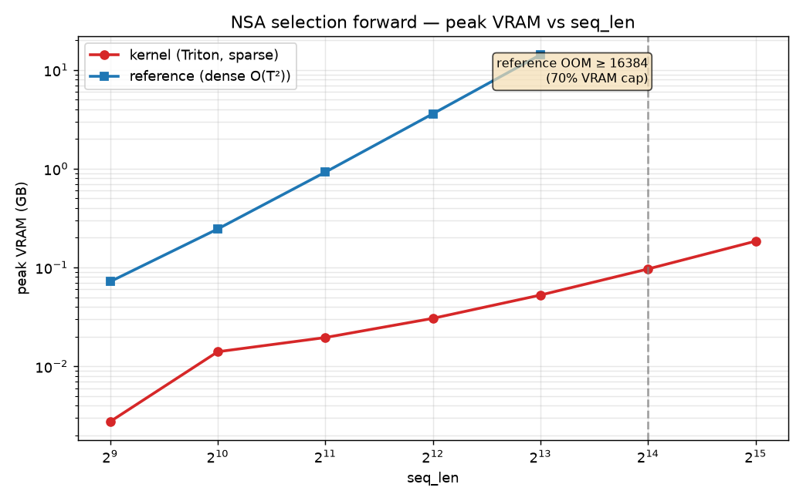
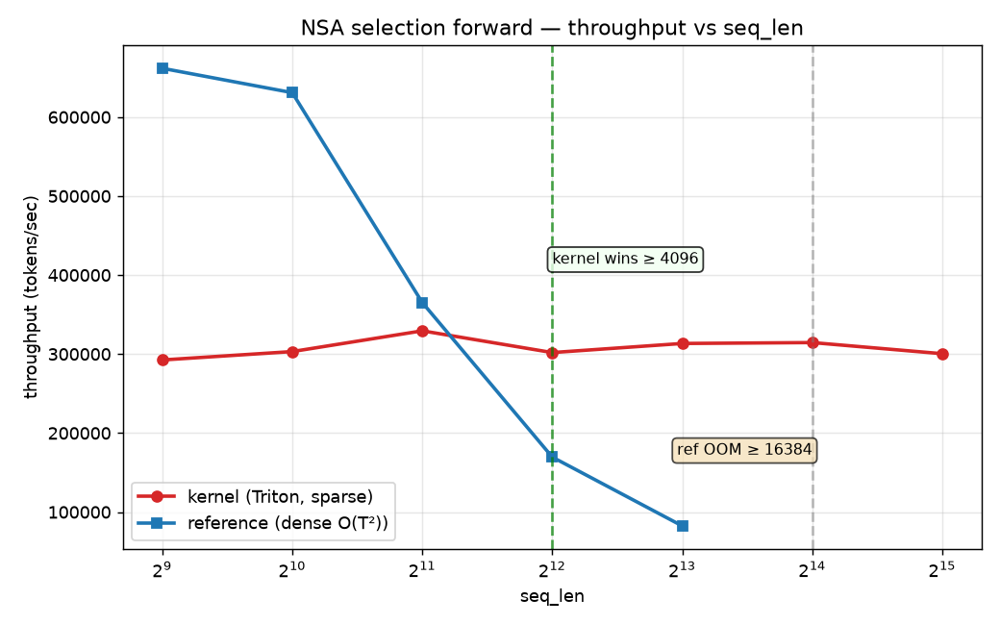
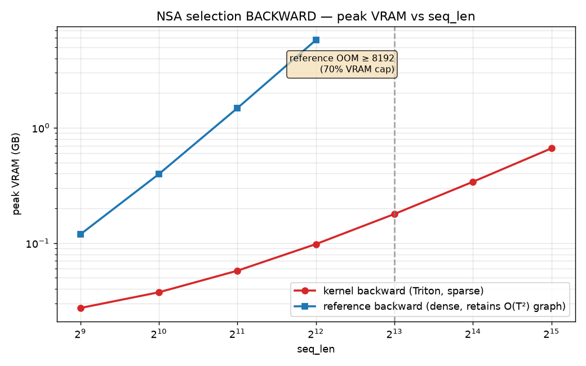
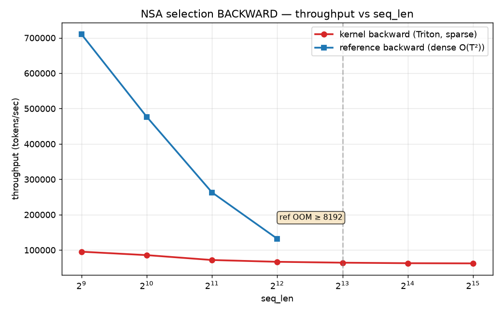
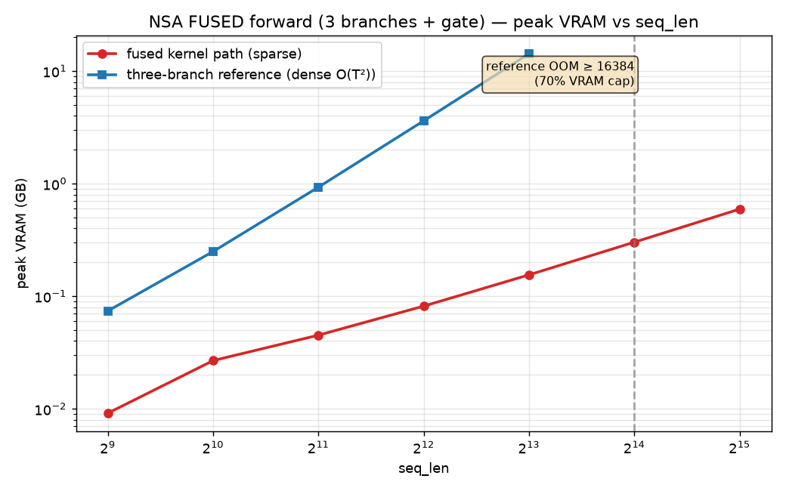
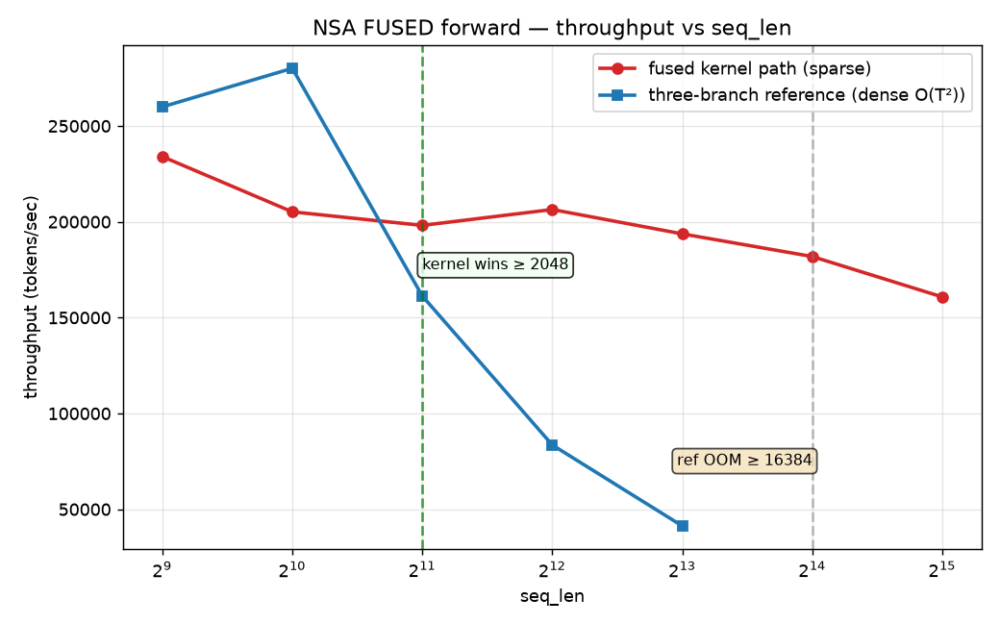

# Open-Box LLM — rungs

- **Rung 1** — pure-PyTorch NSA, prove backward flows through the gate + 3 branches. ↓ below.
- **Rung 2a** — matched NSA-vs-full baseline on real data; does NSA track full attention on held-out val loss? See [Rung 2a](#rung-2a--matched-baseline-nsa-vs-full-attention).
- **Rung 2b (smoke test)** — throughput + peak VRAM for the ~1.5B config on one 3090, to pick a token budget. See [Rung 2b](#rung-2b--15b-smoke-test-throughput--vram).
- **Kernel rung (step 1)** — Triton forward kernel for the NSA selection branch + correctness gate + benchmark. See [Kernel rung](#kernel-rung-step-1--nsa-selection-forward-in-triton).
- **Kernel rung (step 2)** — Triton backward kernel for selection (dQ/dK/dV) + gradcheck gate + benchmark. See [Kernel rung step 2](#kernel-rung-step-2--nsa-selection-backward-in-triton).
- **Kernel rung (step 3)** — fuse compression + window into the kernel path; full three-branch fwd+bwd + gates + bench. See [Kernel rung step 3](#kernel-rung-step-3--fuse-compression--window-full-three-branch-path).

---

# Rung 1: Native Sparse Attention (pure PyTorch)

A minimal, **pure-PyTorch** implementation of **Native Sparse Attention** (NSA,
DeepSeek — [arXiv:2502.11089](https://arxiv.org/abs/2502.11089)) inside a tiny
~24M-param decoder-only transformer.

This is **rung 1** of the [open-box LLM ladder](./openbox-llm-objectives.md). It
answers exactly one question:

> **Does backward flow correctly through the NSA gate and all three branches?**

Success = the model overfits a tiny char-level corpus to near-zero loss, while a
per-step grad-norm table proves every branch received live gradient.

No Triton, no CUDA, no fused kernels, no optimization passes. Correct, not fast —
tiny matmuls are fine at this scale. Dependencies: `torch` + `numpy` only.

## Files

| file | what |
|------|------|
| `nsa_model.py`  | NSA attention (3 branches + gate, GQA) and the tiny transformer. Heavy comments on the branch logic. |
| `train_rung1.py`| Overfit loop over an embedded few-KB corpus. Prints loss + per-branch grad norms; asserts every branch has gradient. |

## How to run

```bash
# torch + numpy already in .venv (see requirements.txt)
python train_rung1.py                 # defaults: 24.4M params, 800 steps
python train_rung1.py --device cpu    # force CPU
python train_rung1.py --steps 400 --log_every 50
```

Runs on a single GPU (RTX 3090) or CPU. The default config is ~24.4M params
(`d_model=512, n_layers=8`, GQA `8` query heads / `2` kv heads).

## What success looks like

1. **Loss collapses toward zero.** Starts ~3.8 (≈ ln 44, uniform over the
   vocab), ends < 0.05 within 800 steps.
2. **Every branch shows non-zero gradient, every step.** After `loss.backward()`
   the loop asserts `compression`, `selection`, `window`, `gate`, and the shared
   `q_proj` all have non-None, non-zero grads, and prints:

   ```
   step  800 | loss 0.0385
     per-branch grad norms:
       compression      grad_norm=1.8238e-03 params_with_grad=64/64 *required
       gate             grad_norm=4.7893e-02 params_with_grad=16/16 *required
       q_proj (shared)  grad_norm=4.7772e-02 params_with_grad=8/8  *required
       selection        grad_norm=6.2920e-02 params_with_grad=16/16 *required
       window           grad_norm=9.4193e-02 params_with_grad=16/16 *required
       ...
   ```
   If any required branch had zero/None gradient, the run **hard-fails** with an
   `AssertionError` — you cannot silently pass rung 1.
3. **It recites the corpus.** A greedy sample from `"Native Sparse Attention"`
   echoes the training text back, confirming the whole stack learned to copy.

## How NSA works here (and the two traps)

For every query, attention is computed three ways and blended by a **learned,
per-head sigmoid gate**:

- **Compression** — squash non-overlapping blocks of `block_size` tokens into one
  coarse *summary* token each (learnable pooling with an intra-block positional
  embedding). Cheap global view.
- **Selection** — pick the **top-k fine-grained blocks** and attend to them at
  full resolution. Block importance is read **off the compression attention**.
- **Sliding window** — attend to the most recent `window` tokens. Local detail.

`out = g_cmp·o_cmp + g_slc·o_slc + g_win·o_win` (per head). GQA: many query heads
share each key/value head; the selection block-choice is shared per group.

**Trap 1 — the top-k pick is non-differentiable.** We `detach()` the importance
scores before `torch.topk`, so the chosen block *indices carry no gradient*. We
never backprop through the hard index pick. Gradient still reaches selection
honestly: (a) through the **gate** and the real attention over the selected
tokens (trains selection's k/v projections), and (b) through the **compression
scores** that rank the blocks (trains the compression branch). See the long
comment block at the top of `nsa_model.py`.

**Trap 2 — you must be able to SEE the gradient.** Hence the hard assertion +
grad-norm table every step (`train_rung1.py`).

### Rung-1 simplifications (deliberate, documented)

- Compression and selection share **one aligned block grid** (non-overlapping,
  stride == block size). This makes "compression score of block *j*" == "selection
  importance of block *j*" with no mapping formula. NSA's general form allows
  overlapping compression blocks; that's a later rung.
- Each branch has its **own k/v projections** (the query projection is shared) so
  every branch is a cleanly nameable parameter group in the grad table.
- Selection is implemented as full-score attention with a keep-mask rather than
  gathering/packing blocks — identical math, far easier to read and verify.
- Positional scheme is plain learned embeddings. RoPE + YaRN is rung 2+.

## Not in scope for rung 1

Speed/kernels, long context, the trainable memory layer, quantization/offload —
all later rungs. See `openbox-llm-objectives.md`.

---

# Rung 2a — matched baseline: NSA vs full attention

**Question:** does NSA track full attention on a *generalization* task (held-out
val loss), and is our matched-baseline harness sound?

The **harness is the deliverable.** One codebase, the attention module swapped by a
single flag — `--attn {nsa,full}` — with *everything else held identical*: same
transformer, same tokenized data **and data order** (batches are precomputed from
the seed, so both arms see byte-identical inputs in the same order), same seed,
optimizer, schedule, steps, and eval set. The only thing that differs is the
attention math (`FullAttention` vs `NSAAttention` in `nsa_model.py`, selected in
`make_attention()`).

## Files (added this rung)

| file | what |
|------|------|
| `data_prep.py`   | Stream a FineWeb-Edu sample, tokenize with GPT-2 BPE (tiktoken), cache a fixed train/val split to `data/*.bin` (uint16). Tokenized **once**. |
| `train_rung2a.py`| The matched harness. `--attn {nsa,full}`; logs train+val loss to CSV, writes config JSON + checkpoint. |
| `plot_val.py`    | Overlay both val-loss curves → `plots/val_loss.png`. **This plot is the result.** |
| `run_rung2a.sh`  | data → full → nsa → plot, all under `nice -n 10`. |
| `nsa_model.py`   | +`FullAttention` (matched GQA baseline) and `attn_type` flag. |

## How to run

```bash
source .venv/bin/activate
# one command does everything (data is cached, so reruns skip tokenization):
nice -n 10 ./run_rung2a.sh                      # optional: pass extra flags, e.g. --steps 8000

# or step by step:
nice -n 10 python data_prep.py                  # -> data/train.bin, data/val.bin (once)
nice -n 10 python train_rung2a.py --attn full   # baseline
nice -n 10 python train_rung2a.py --attn nsa    # NSA
nice -n 10 python plot_val.py                   # -> plots/val_loss.png
```

Defaults: ~150M params, `d_model=768, n_layers=16`, GQA `12q/4kv`, `seq_len=512`,
`batch=8`, `5000` steps, bf16 autocast. Both arms train in well under an hour each
on an RTX 3090.

## Matched configs & the param delta

Both arms are byte-for-byte identical except attention. NSA is slightly larger —
its three branches each carry their own k/v projections, plus a block compressor
and the gate. Everything else (embeddings ≈38.6M tied, FFN, LayerNorms, shared
query projection, output projection) is the same.

| config | params | where the delta lives |
|--------|--------|-----------------------|
| `full` | ~140.2M | 1× k/v projection per layer |
| `nsa`  | ~153.4M | 3× k/v projections + compressor + gate per layer |
| **Δ**  | **+13.2M (~9%)** | entirely inside attention; hidden dims otherwise identical |

(Run either arm; the exact count for both is printed and saved to
`runs/{attn}_config.json`.)

## What success looks like

- **NSA's val curve tracks full attention within a small margin** — the paper says
  NSA can match or beat dense; for this rung we only need *tracks, no pathology*
  (no divergence, no blow-up, no stuck-high loss). `plot_val.py` prints the final
  `gap(nsa-full)` and annotates it on the plot.
- Both curves descend smoothly on held-out data (train < 1 epoch, so val is a real
  generalization measurement, not memorization).

## Reproducibility

Seeded (`--seed`, default 1337) across torch/numpy/cuda and the data-window
schedule. `requirements.txt` pins the environment; each run's full config +
param counts + data meta are saved to `runs/{attn}_config.json`; checkpoints to
`runs/{attn}_ckpt.pt`.

## Resource discipline (Miu is a daily-use workstation)

- `torch.set_num_threads(4)` — leaves cores for the desktop.
- Dataloader `num_workers=2, pin_memory=True` (not `os.cpu_count()`).
- Run everything `nice -n 10` (baked into `run_rung2a.sh`).
- VRAM: default `batch=8, seq_len=512` peaks ~14GB (NSA) / ~9GB (full) — well under
  21GB free. `PYTORCH_CUDA_ALLOC_CONF=expandable_segments:True` is set to avoid
  fragmentation OOMs. **If you raise batch/context and near OOM, lower `--batch_size`
  — never let it spill to system RAM/swap.**
- Data is streamed as a small subset and cached to `data/` once, not re-tokenized
  per run.

## Rung-2a scope / caveats

Still pure PyTorch, full-score + keep-mask (correct, not fast — block-gather and
Triton are later rungs). `seq_len=512` is short: NSA's efficiency payoff is a
*long-context* story (64k+) and is explicitly **not** what this rung measures —
here we only check that sparse attention generalizes on par with dense at small
scale, and that the comparison harness is sound.

---

# Rung 2b — 1.5B smoke test (throughput + VRAM)

**Smoke test only — no full run, no plot.** Goal: measure real throughput and peak
VRAM for the ~1.5B config on this 3090 so we can pick a token budget. Hard cap:
peak VRAM **< 18GB** (Xorg already uses ~3GB of the 24GB card).

Run it (`smoke_rung2b.py`, ~60s of real fwd+bwd+opt steps):

```bash
nice -n 10 python smoke_rung2b.py --attn nsa --batch 16 \
    --optim adam8bit --weight_dtype bf16 --grad_ckpt --seconds 60
```

## The 1.5B config (scaled from rung 2a, same-hidden-dims framing)

`d_model=2048, n_layers=30, GQA 16 q-heads / 4 kv-heads, ffn_mult=4, ctx 512`.

| arm | params |
|-----|--------|
| `full` | **1.426B** |
| `nsa`  | **1.556B** (delta = NSA's per-branch k/v + gate + compressor, all in attention) |

## The problem: a fixed ~25GB floor

A 1.5B model under **plain fp32 AdamW** needs ~4× params of memory just for
weights + grads + Adam moments (m, v) = ~25GB. That FIXED cost busts the 24GB card
*before any activations* — so batch size and gradient checkpointing (which only
shrink activation memory) can't fix it. Measured:

| step | config | result |
|------|--------|--------|
| baseline | fp32 AdamW, batch 4 | **OOM** (~24.1GB) |
| ladder 1 | fp32 AdamW, batch **1** | **OOM** (~23.9GB) — batch doesn't help |
| ladder 2 | fp32 AdamW, batch 1, **+ckpt** | **OOM** (~24.1GB) — ckpt doesn't help |
| ladder 3 | **8-bit Adam** + ckpt, batch 1 | runs, but **19.1GB > 18GB cap** |

8-bit Adam cuts the moments (12.4GB → 3.1GB) but fp32 params+grads are still a
12.4GB floor → 19.1GB, over cap. The lever that actually gets under 18GB without
shrinking the model is **bf16 master weights** (params+grads 12.4GB → 6.2GB). That
purity was already gone once we quantized the optimizer, so it's the honest move
for 1.5B on a 24GB card.

## Working config (all four levers) + throughput

**bf16 weights + 8-bit Adam + gradient checkpointing**, ctx 512:

| arm | batch | tok/s | peak VRAM | under 18GB? |
|-----|------:|------:|----------:|:-----------:|
| nsa (1.556B) | 8 | 2400 | 12.05GB | ✅ |
| nsa | **16** | **2730** | **14.70GB** | ✅ **(recommended)** |
| nsa | 24 | 2763 | 17.35GB | ✅ (max throughput, tight) |
| nsa | 32 | — | OOM (~20GB) | ❌ |
| full (1.426B) | 16 | 4216 | 13.91GB | ✅ |

Checkpointing is **required** here (without it, NSA's 30 layers of full-score
attention OOM even in bf16). Throughput plateaus past batch 16 (2730→2763), so
**batch 16 is the pick**: 2730 tok/s at 14.7GB with real headroom. NSA runs ~0.65×
the full arm's throughput — expected, since it computes three branches and pays the
checkpointing recompute (and this is the deliberately-slow full-score path, not
kernels).

## Token-budget implication (the point of the smoke test)

At **~2730 NSA tok/s** on one 3090: ~9.8M tok/hour, ~236M tok/day, ~0.47B over a
weekend. A Chinchilla-optimal 1.5B (~30B tokens) would take **~127 days** — off the
table on a single card. So rung 2b proper should target a **modest budget**
(a few hundred M to ~1B tokens, i.e. hours-to-a-few-days), not compute-optimal
scale. Fast kernels (Triton) and/or multi-GPU are what a real 1.5B run needs — a
later rung.

## Caveats

Numbers are for the pure-PyTorch full-score path (correct, not fast). The
bf16-master + 8-bit-Adam recipe trades numerical headroom for fit; a real run
should watch for instability (loss spikes) and can fall back to fewer layers or a
smaller `d_model` if needed. This rung measured *fit and speed only* — not loss.

---

# Kernel rung (step 1) — NSA selection forward in Triton

**Question:** can we make the selection branch — the branch whose cost NSA actually
cuts — a real Triton kernel that *matches the reference* and *scales past where dense
attention OOMs*? **Forward only** (backward is the next step). Compression and
sliding-window stay pure PyTorch for now.

Correctness comes first: **fast-but-wrong fails the gate.**

## Files (added this rung; purely additive — rung-1/2a files untouched)

| file | what |
|------|------|
| `nsa_selection_kernel.py` | `selection_forward_reference` (pure torch, = rung-1's selection math) and `selection_forward_triton` (the kernel + launch wrapper). |
| `test_kernel.py` | Correctness gate: `allclose(kernel, reference)` across shapes. |
| `bench_kernel.py` | Throughput + VRAM sweep → CSV + two plots. |

## How to run

```bash
source .venv/bin/activate
nice -n 10 python test_kernel.py     # must print "GATE GREEN" first
nice -n 10 python bench_kernel.py    # -> plots/{vram,toks}_vs_seqlen.png + CSV
```

## The kernel

FlashAttention-style: one program per `(batch·kv-head, query position)`, online
softmax, fp32 accumulation. The inner loop **iterates the gathered selected-block
index list** (`block_idx[b, kv, i, :]`) — a gather, not a contiguous KV scan — which
is the whole point. Q for the **whole GQA group** is loaded once so each gathered
K/V block is reused by all `G` query heads (the gather amortizes across the group).
bf16 in / fp32 accumulate, `tl.dot` (group padded to 16 lanes), autotuned over
`num_warps`/`num_stages`. Targets Ampere (sm_86, RTX 3090).

The block choice is an **input** (the compression branch produces it in the full
model), so the kernel is tested in isolation. Trap-1 handling is unchanged: the
top-k pick is upstream and non-differentiable; this kernel only consumes the index
list.

## Correctness gate — GREEN

`test_kernel.py` varies seq_len, #heads, GQA group (incl. `G=1` and non-power-of-two
`G=3`), head dim (32/64/128), block_size, and `S` (including `S >` a row's valid
block count). All configs pass with max abs error **1e-5 – 2e-3** — far inside the
bf16 tolerance (2e-2); the residual is just bf16 output rounding + summation order.

## Benchmark — VRAM and the crossover

`B1 Hq16 Hkv4 D64, block_size 64, S 16` (⇒ 1024 selected keys/query, **constant in
T**). The reference is O(T²) (materializes the `[T,T]` score matrix); the kernel is
O(T) (touches only the selected keys).

| seq_len | kernel tok/s | kernel VRAM | ref tok/s | ref VRAM |
|--------:|-------------:|------------:|----------:|---------:|
| 512   | 292k | 0.003 GB | 662k | 0.07 GB |
| 1024  | 303k | 0.014 GB | 631k | 0.25 GB |
| 2048  | 329k | 0.020 GB | 365k | 0.92 GB |
| **4096**  | **302k** | 0.031 GB | **170k** | 3.60 GB | ← kernel wins from here |
| 8192  | 313k | 0.053 GB | 82k  | 14.24 GB |
| 16384 | 315k | 0.097 GB | **OOM** | **OOM** | ← reference OOM ceiling |
| 32768 | 300k | 0.185 GB | OOM | OOM |




- **Throughput crossover: seq_len ≥ 4096.** Below that the dense reference is faster
  (big efficient matmuls); above it the reference's O(T²) work dominates and the
  sparse kernel's ~constant ~300k tok/s wins.
- **Reference OOM ceiling: seq_len ≥ 16384** (under the 70% VRAM cap). Logged as a
  real result — the bench catches `torch.cuda.OutOfMemoryError`, records the ceiling,
  `empty_cache()`s, and continues. The kernel runs to 32k on <0.2 GB.

## Resource discipline

`torch.cuda.set_per_process_memory_fraction(0.70)` (hard-cap ~17GB, leaves ~7GB for
Xorg/browser), `torch.set_num_threads(4)`, `nice -n 10`. OOM fails cleanly inside the
budget instead of taking the desktop down.

## Scope / next

Forward only, selection branch only. Not yet done: the **backward kernel** (next
step), fusing compression+window, and wiring the kernel back into `nsa_model.py`
behind a flag. The kernel's absolute tok/s isn't tuned to the limit (broadcast-free
`tl.dot` with a small padded group leaves throughput on the table) — the win here is
**scaling** (flat VRAM, no O(T²) wall), which is what NSA is for.

---

# Kernel rung (step 2) — NSA selection backward in Triton

**Question:** can the selection branch's **backward** (dQ, dK, dV) be a Triton kernel
that matches autograd through the reference *and* keeps the flat-VRAM scaling? This
step is **backward only** — fusion (compression+window) and `nsa_model.py` wiring are
separate later steps. Purely additive: rung-1/2a files and the step-1 forward
kernel/tests are untouched.

## Files (added this step)

| file | what |
|------|------|
| `nsa_selection_backward.py` | Triton backward kernel + `SelectionAttnTriton` autograd Function (Triton fwd + Triton bwd). |
| `test_kernel_backward.py` | Gradcheck gate: Triton dQ/dK/dV vs autograd through `selection_forward_reference`. |
| `bench_kernel_backward.py` | Backward throughput + VRAM sweep → CSV + two plots. |

## Approach — softmax stats: RECOMPUTE (FlashAttention-2 style)

The forward returns only `O` (we're not allowed to modify it to also emit the
log-sum-exp), so the backward is self-contained:
- **pass 1** re-derives per-row `(m_i, l_i)` with the *same* online-softmax loop as
  forward (finite `NEG=-1e9` mask → all-masked rows never NaN),
- **pass 2** recomputes `p_ij = exp(s_ij − m_i)/l_i` and the grads.

Only `delta_i = Σ_d dO_i·O_i` is precomputed in torch from the saved `O`. Recompute
(vs storing `p`) is what keeps memory **O(T)** — `p` is `[T × selected_keys]` and
storing it would defeat the point. **dQ** is accumulated per query program (each
query owns its row — no conflict). **dK/dV** are scattered (many queries select the
same key block) via fp32 `atomic_add` into fp32 accumulators, cast to input dtype at
the end. Same gather-not-scan structure as forward; `tl.dot` with the GQA group
padded to 16 lanes.

## Gradcheck gate — GREEN

We can't use `torch.autograd.gradcheck`'s float64 numerical Jacobian (Ampere `tl.dot`
has no fp64 path), so we compare analytical Triton grads vs analytical
autograd-through-reference grads — a stronger check (exact vs exact). Same config
matrix as the forward gate.

| dtype | max dQ err | max dK err | max dV err | tol | verdict |
|-------|-----------:|-----------:|-----------:|-----|:-------:|
| fp32  | 1.7e-6 | 4.1e-6 | 4.1e-6 | 2e-3 | **PASS** (all 7 configs) |
| bf16  | 7.8e-3 | 1.6e-2 | 3.9e-3 | 6e-2 | **PASS** (all 7 configs) |

(across seq_len, #heads, GQA `G=1/2/3/4`, head dim 32/64/128, block_size, `S>` valid.)

**Bug hit:** dK/dV came out ~1000× too large while dQ was exact. Cause: `triton.autotune`
benchmarks each config by relaunching the kernel on the *same* output buffers, and
dK/dV use `atomic_add` (accumulate) — so every trial piled on. dQ was fine because it
uses `tl.store` (overwrite). Fix: `@triton.autotune(..., reset_to_zero=["dk_ptr","dv_ptr"])`.

## Benchmark — flat VRAM holds for backward

`B1 Hq16 Hkv4 D64, block_size 64, S 16`. Reference backward must **retain the O(T²)
forward graph** (the `[T,T]` softmax probs) to differentiate; the kernel recomputes
over the gathered blocks and only allocates dQ/dK/dV.

| seq_len | kernel tok/s | kernel VRAM | ref tok/s | ref VRAM |
|--------:|-------------:|------------:|----------:|---------:|
| 512   | 96k | 0.03 GB | 711k | 0.12 GB |
| 1024  | 73k | 0.04 GB | 408k | 0.40 GB |
| 2048  | 67k | 0.06 GB | 247k | 1.48 GB |
| 4096  | 58k | 0.10 GB | 120k | 5.77 GB |
| 8192  | 59k | 0.18 GB | **OOM** | **OOM** |
| 16384 | 58k | 0.34 GB | OOM | OOM |
| 32768 | 54k | 0.66 GB | OOM | OOM |




- **Flat-VRAM scaling confirmed**: kernel 0.03 → 0.66 GB (O(T)); reference O(T²),
  **OOM at seq_len ≥ 8192** (logged as data — caught, recorded, `empty_cache`,
  continued). The kernel runs to 32k on 0.66 GB.
- **Honest speed note:** unlike the *forward* (which crossed over at 4096), the
  backward kernel is *slower per-token* than the dense reference wherever the
  reference fits — dense uses big efficient cuBLAS matmuls; the kernel pays for
  (a) two passes (can't store the LSE — forward is unmodified), (b) the GQA group
  padded to 16 lanes wasting ~4× for `G=4`, and (c) atomic scatter. Its win here is
  **scaling** (constant VRAM, runs where dense OOMs), not raw throughput at moderate
  T. Closing the speed gap (store LSE if forward is later allowed to emit it, tile
  the group without padding, split-K for dK/dV) is a future optimization step.

## Resource discipline

`set_per_process_memory_fraction(0.70)`, `set_num_threads(4)`, `nice -n 10`; OOM
caught, never crashes the process or spills.

---

# Kernel rung (step 3) — fuse compression + window (full three-branch path)

**Question:** can we bring **all three NSA branches** onto the kernel path
(compression + selection + window, recombined by the gate) and keep flat-VRAM
scaling — forward *and* backward? This step is **fusion only**; wiring into
`nsa_model.py` is the separate final step. Purely additive: rung-1/2a, the forward
kernel, and the backward kernel are untouched — this composes them.

## Design choice: separate-but-composable, NOT a mega-kernel

The three branches are each softmax-normalized **independently** and then **linearly
blended by the gate** — it is *not* one attention over concatenated keys. So a single
mega-kernel would carry three online-softmax states + three mask logics per program
(heavy register pressure, and a brutal fused backward on top of the already 2-pass /
atomic / group-padded selection backward). Instead:

- **selection** — reuse the step-1/step-2 kernel **unchanged**.
- **compression + window** — *one generic "range-attention" kernel* (fwd+bwd) with a
  `MODE` flag, because both are "query *t* attends a contiguous causal key range":
  window `[t−W+1, t]` over raw keys; compression `[0, (t+1)//Bsz − 1]` over pooled
  summary tokens. A **runtime-bounded tile loop** keeps window at O(T·W), not O(T²).
- **pooling** (compression summary tokens) — plain torch block-mean (cheap O(T·D),
  differentiable), kept out of the kernel.
- **gate combine** — torch elementwise.

Each branch attention is its own `autograd.Function` (Triton fwd + Triton bwd), so
PyTorch autograd chains the whole fused forward — **no monolithic backward needed**,
and gradcheck on the fused output exercises everything.

## Files (added this step)

| file | what |
|------|------|
| `nsa_fused_kernel.py` | Generic range-attention kernel (fwd+bwd) for compression/window; `nsa_fused_forward` (kernel path) + `nsa_fused_reference` (pure-torch three-branch, = rung-1 math). |
| `test_kernel_fused.py` | Forward allclose + backward gradcheck (all 8 differentiable inputs). |
| `bench_kernel_fused.py` | Fused forward tok/s + VRAM sweep → CSV + two plots. |

## Masking per branch (the causal/boundary rules, matched to rung-1)

- **compression**: summary token *j* visible to query *t* iff `(j+1)·Bsz − 1 ≤ t`
  ⇒ range `[0, (t+1)//Bsz − 1]` over the pooled sequence. Rows with `t < Bsz` have
  **no** valid block → output 0 (finite `NEG` + zeroing, never NaN).
- **selection**: unchanged (gathered blocks, causal within block).
- **window**: `key ≤ query` and `query − key < W` ⇒ range `[t−W+1, t]`.

## Gates — both GREEN

Same config matrix as fwd/bwd (seq_len, GQA `G=1/2/3/4`, head dim 32/64/128,
block_size, `S >` valid); analytical-vs-analytical for backward.

| gate | dtype | max error | tol | verdict |
|------|-------|----------:|-----|:-------:|
| forward (3-branch) | fp32 | 5.4e-7 | 2e-3 | **PASS** (7/7) |
| forward (3-branch) | bf16 | 3.9e-3 | 3e-2 | **PASS** (7/7) |
| gradcheck (q,kc,vc,ks,vs,kw,vw,gate) | fp32 | 4.3e-6 | 3e-3 | **PASS** (7/7) |
| gradcheck (8 inputs) | bf16 | 1.6e-2 | 7e-2 | **PASS** (7/7) |

(grads to `kc`/`vc` flow through the torch block-mean pooling via autograd.)

## Bench — flat VRAM holds for the whole fused path

`B1 Hq16 Hkv4 D64, block_size 64, S 16, window 512`. Reference materializes `[T,T]`
for window + selection (O(T²)); the fused kernel path never does.

| seq_len | fused tok/s | fused VRAM | ref tok/s | ref VRAM |
|--------:|------------:|-----------:|----------:|---------:|
| 1024  | 205k | 0.03 GB | 280k | 0.25 GB |
| **2048**  | 198k | 0.05 GB | 161k | 0.93 GB | ← kernel wins from here |
| 4096  | 206k | 0.08 GB | 84k  | 3.62 GB |
| 8192  | 194k | 0.16 GB | 41k  | 14.27 GB |
| 16384 | 182k | 0.30 GB | **OOM** | **OOM** |
| 32768 | 161k | 0.59 GB | OOM | OOM |




- **Flat-VRAM confirmed for all three branches**: fused 0.009 → 0.59 GB (O(T)),
  runs to 32k; reference O(T²), **OOM at seq_len ≥ 16384** (logged as data).
- **Throughput crossover at 2048** — the full fused forward beats dense from 2k
  onward *and* keeps going where dense OOMs. (Better than the backward-only step,
  which never crossed before OOM, because the forward path is single-pass, no atomics.)

## Bug hit

The range kernel referenced module-global `MODE_WINDOW` inside `@triton.jit` →
`NameError: Cannot access global variable ... not constexpr`. Fixed by comparing the
`MODE` constexpr arg against a literal (`if MODE == 0:`) inside the kernel. Also
trimmed the autotune space (2 MODEs × fwd/bwd compile many variants) to keep gate
runtime reasonable.

## Resource discipline / scope

`set_per_process_memory_fraction(0.70)`, `set_num_threads(4)`, `nice -n 10`; OOM
caught, never crashes/spills. Pooling and the gate-combine are torch (not fused into
a kernel); q is re-read per branch — negligible here, and the win (flat VRAM,
crossover at 2k) dominates. **Next (separate) step:** wire this fused path into
`nsa_model.py` behind a flag.
